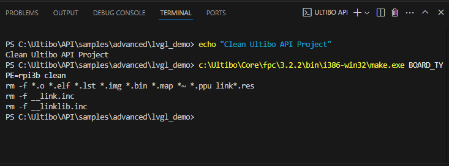

<h1 align="center">Ultibo API Tool - Build Project</h1>

<strong>Build an Ultibo API project.</strong>

    

  

## Open Tool

Select the icon in the Activity Bar.

You have the option to select an project folder or open this tool.

    

  
## Usage

    

Select the Board Type you need.

    

> Note: The selected board is automatically saved.

  
## Build

Clicking the `Build` button will automatically open a terminal that will perform the corresponding action.
If successful, the corresponding kernel along with new files will appear in Explorer.

    

  
## Clean

Clicking the `Clean` button will automatically open a terminal that will perform the corresponding action.
The corresponding kernel will be deleted, along with any newly created files.

    

