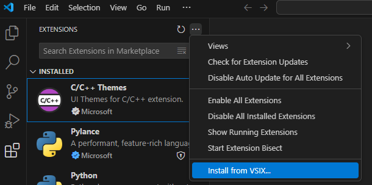

## Installation

Open the Extensions view by selecting the Extensions icon in the Activity Bar, or use the `Ctrl+Shift+X` keyboard shortcut.

Select the "three dots" button in the top right corner. And choose the `Install from VSIX...` option.

    

If you try to install this extension in restricted mode, you will be prompted to trust the workspace or simply install the extension.

    

> Note: You must select `Trus Workspace & Install`, otherwise the extension will not work.

If installed successfully, an icon should appear in the Activity Bar

    

