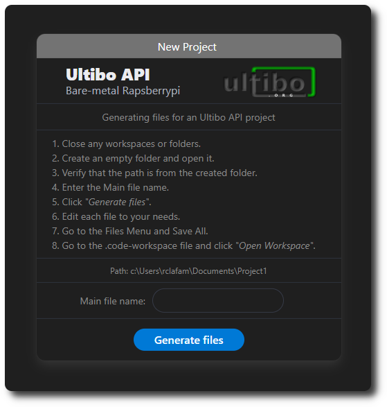

<h1 align="center">Ultibo API Tool - New Project</h1>

<strong>Generating files for an Ultibo API project.</strong>

    

  

## Open Tool

Select the icon in the Activity Bar.

You have the option to select an empty folder or open this tool.

    

  
## Usage

    

These are the steps you must follow to generate the files.

|            | STEP |
|:--------------------|:-------------|
|1.    | Close any workspaces or folders.|
|2.    | Create an empty folder and open it.|
|3.    | Verify that the `path` is from the created folder.|
|4.    | Enter the `Main file name`.|
|5.    | Click `Generate files`.|
|6.    | Edit each file to your needs.|
|7.    | Go to the Files Menu and `Save All`.|
|8.    | Go to the `.code-workspace` file and click `Open Workspace` to open your new project.|

    

> Note: If the folder already contains files, these will be overwriters!.  
Also if `Main file name` is empty or `path` is undefined, no files are generated and warning messages will be displayed.

## Files generated
For example, if `Main file name` is `"test1"`, then the following files will be generated:

|  File           | Description|
|:--------------------|:-------------|
| initunit.pas    | This unit is included first in the project file it can be used to update default settings used during boot.|
| Makefile |The `make` utility requires this file to define the build rules for a project, primarily for compiling and linking source code.  |
| test1.c    | Contains the main program in C or C++ language.|
| test1.code-workspace | File that automatically restores all workspace settings used by VScode.|
| test1project.lpi     | Lazarus Project Information file (contains project-specific settings) .|
| test1project.lpr | Lazarus Program file, contains Pascal source of main program.|

