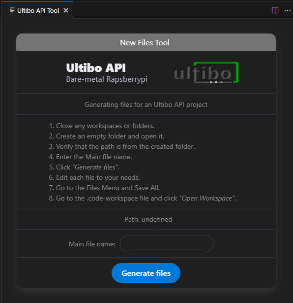
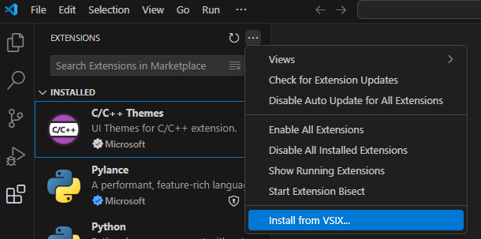
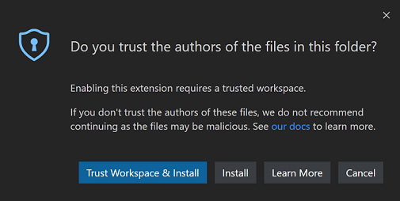
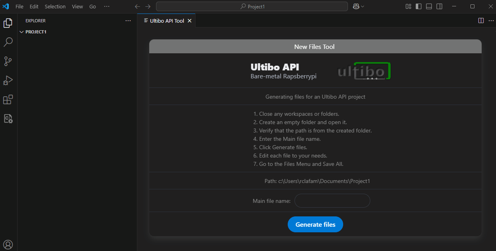

<h1 align="center">
    
   
	 
	Ultibo API Tool for VSCode
</h1>

<strong>Generating files for an Ultibo API project.</strong>

## Installation

Open the Extensions view by selecting the Extensions icon in the Activity Bar, or use the `Ctrl+Shift+X` keyboard shortcut.

Select the "three dots" button in the top right corner. And choose the `Install from VSIX...` option.

    

If you try to install this extension in restricted mode, you will be prompted to trust the workspace or simply install the extension.

    

> Note: You must select `Trus Workspace & Install`, otherwise the extension will not work.

## Usage

Open the `Command Palette` use the  `Ctrl+Shift+P` keyboard shortcut. 
And type `Ultibo API Tool`

    

These are the steps you must follow to generate the files.

|            | STEP |
|:--------------------|:-------------|
|1.    | Close any workspaces or folders.|
|2.    | Create an empty folder and open it.|
|3.    | Verify that the `path` is from the created folder.|
|4.    | Enter the `Main file name`.|
|5.    | Click `Generate files`.|
|6.    | Edit each file to your needs.|
|7.    | Go to the Files Menu and `Save All`.|

> Note: If the folder already contains files, these will be overwriters!.  
Also if `Main file name` is empty or `path` is undefined, no files are generated and warning messages will be displayed.

## Files generated

For example, if `Main file name` is `"test1"`, then the following files will be generated:

|  File           | Description|
|:--------------------|:-------------|
| Makefile |The `make` utility requires this file to define the build rules for a project, primarily for compiling and linking source code.  |
| test1.c    | Contains the main program in C or C++ language.|
| test1.code-workspace | File that automatically restores all workspace settings used by VScode.|
| test1project.lpi     | Lazarus Project Information file (contains project-specific settings) .|
| test1project.lpr | Lazarus Program file, contains Pascal source of main program.|

    

## Additional information

- Official forum and solution to doubts from [Forum Ultibo](https://ultibo.org/forum/index.php).
- Ultibo API examples and information [Ultibo API](https://github.com/ultibohub/API).
