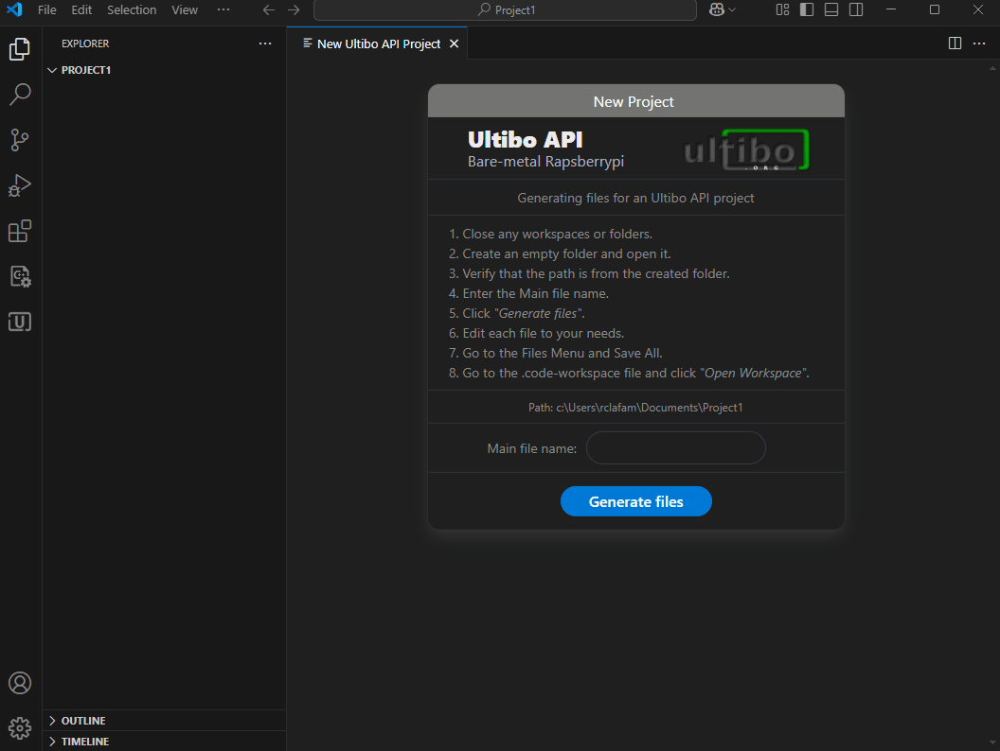

<h1 align="center">Ultibo API Tool for VSCode</h1>

<strong>New and Build Project for Ultibo API.</strong>

    

  

## Installation
Detailed information can be found at [The complete installation guide](https://github.com/rcla/Ultibo_API_Tool/blob/master/INSTALLATION.md)
  

## New Project

    

Detailed information can be found at [The complete guide to creating a new project](https://github.com/rcla/Ultibo_API_Tool/blob/master/NEWPROJECT.md)

  
## Build Project

    

Detailed information can be found at [The complete guide to build project](https://github.com/rcla/Ultibo_API_Tool/blob/master/BUILDPROJECT.md)

  
## Additional information

- Official forum and solution to doubts from [Forum Ultibo](https://ultibo.org/forum/index.php).
- Ultibo API examples and information [Ultibo API](https://github.com/ultibohub/API).
